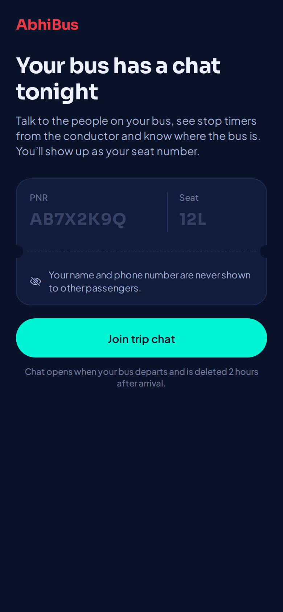
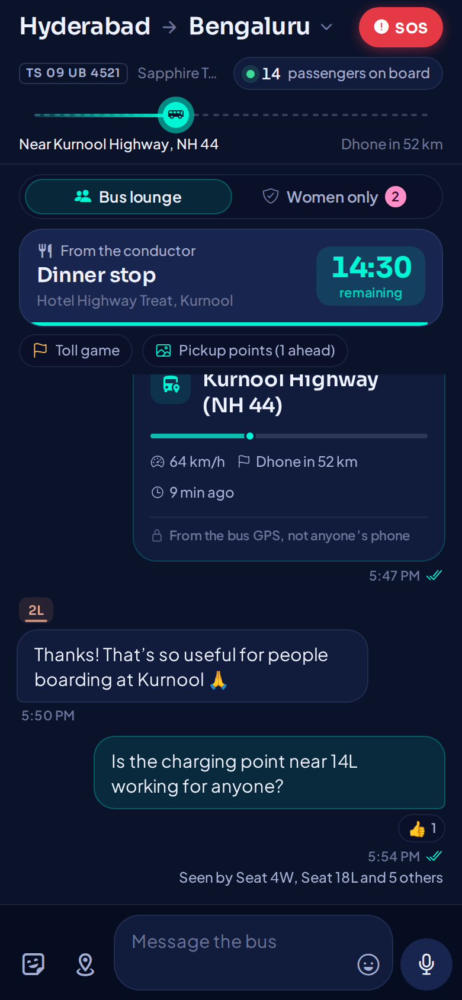
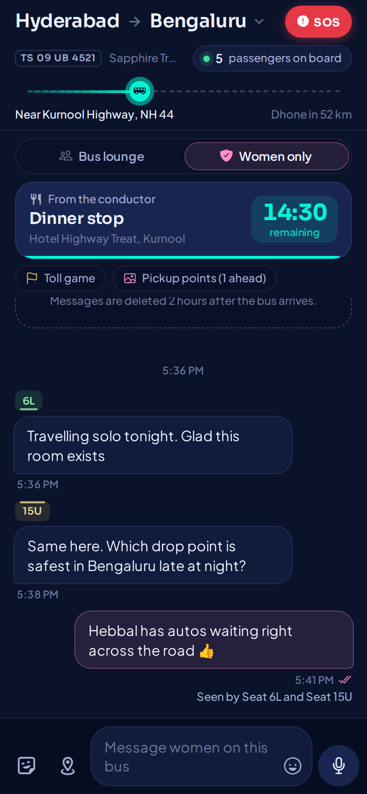
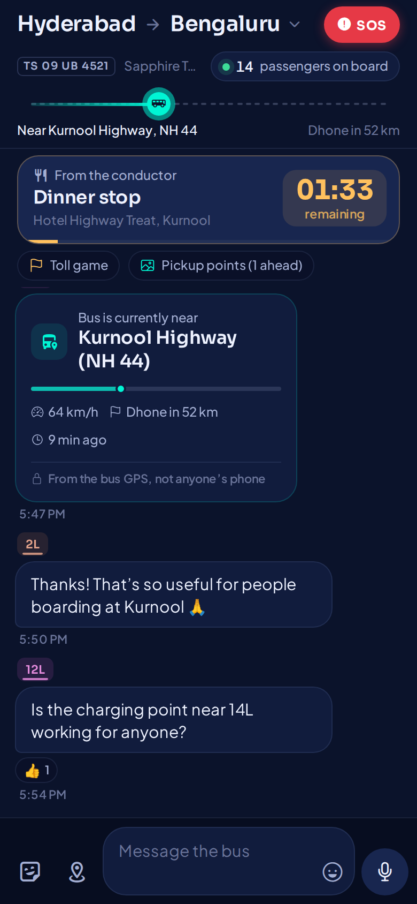
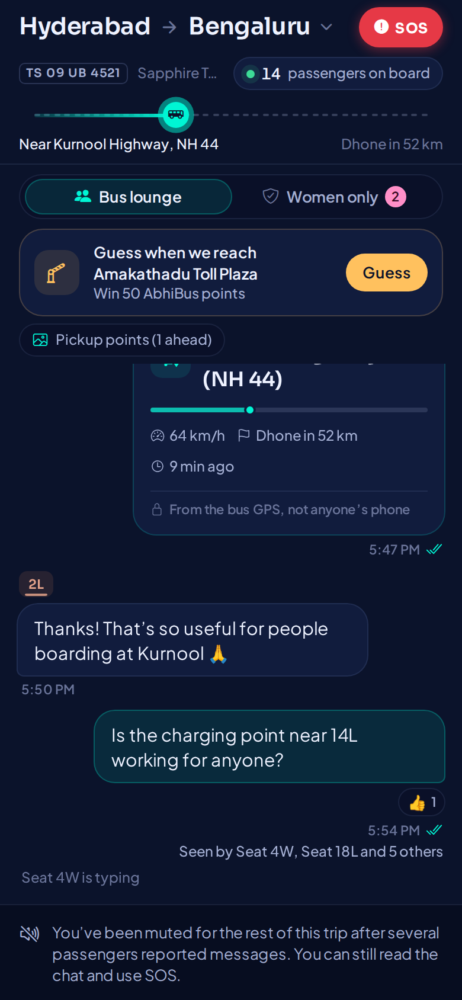

# AbhiBus Live Journey Companion & Chat

A time-bound chat for everyone on the same bus. It opens when the bus departs and deletes itself 2 hours after arrival. Passengers get in with their PNR and appear only as their seat number.

| PNR join | Bus lounge | Women-only room | Urgent rest stop (male view) | Toll game, typing, muted |
|---|---|---|---|---|
|  |  |  |  |  |

These screenshots are the real React Native screens rendered on web with seeded demo data.

---

## 1. Run the demo in 10 minutes

You need Node 20+, Docker, and Xcode or Android Studio. Voice-to-text is a native module, so the app runs as an Expo **development build**. Expo Go won't work.

```bash
# 0. Copy the shared contract into both apps (already done in this zip; re-run after editing /shared)
./scripts/sync-shared.sh

# 1. Database
docker compose up -d postgres

# 2. Server
cd server
cp .env.example .env              # then replace the 4 secrets (see below)
npm install
npx prisma migrate dev --name init
npm run dev                       # → 🚌 Journey chat on :4000 (booking=mock, demo=true)

# 3. App (new terminal)
cd mobile
cp .env.example .env              # set EXPO_PUBLIC_API_URL (see the comments in the file)
npm install
npx expo run:ios                  # or: npx expo run:android
```

Generate the four secrets in `server/.env` with `openssl rand -hex 32`. They are `JWT_SECRET`, `PHONE_HASH_PEPPER`, `CONDUCTOR_API_KEY` and `OPS_API_KEY`. The server refuses to start if any of them is weak or missing.

### The leadership walkthrough

With `DEMO_MODE=true`, the join screen shows **three demo tickets** you can tap. The bus starts near Kurnool on NH 44, and simulated co-passengers chat, read your messages and react.

| Ticket | What it shows |
|---|---|
| `AB7X2K9Q` seat 12L | Solo woman. The Women only toggle appears. |
| `AB4M8R2T` seat 7U | Solo man. No toggle at all, and the server rejects the room even if the app is modified. |
| `ABFAM026` seat 3L / 4L | Family on one PNR. A seat locks to the first phone that claims it. |

The scripted moments are automatic: a conductor announcement after about 3s, the toll-game invite after about 8s, and a 15-minute dinner-stop countdown after about 25s. To drive the conductor side yourself:

```bash
export CONDUCTOR_API_KEY=... OPS_API_KEY=...     # from server/.env
./scripts/demo-conductor.sh rest      # pin a 15-min dinner stop
./scripts/demo-conductor.sh say "Washroom break in 10 minutes"
./scripts/demo-conductor.sh arrive    # arrival → "chat deleted at …" → purge 2h later
```

Restarting the server resets the demo trip.

Things worth trying live:
- Send "call me 98765 43210". The input shakes and explains why. This happens on the phone instantly and is enforced again on the server.
- Tap the location pin to drop a card with the bus GPS position.
- Long-press a message to react, report or block.
- Tap the double ticks to see who has seen it.
- Hold SOS for 1.5 seconds.

---

## 2. What's in the box

```
shared/            Realtime contract + content filter. The single source of truth.
  protocol.ts        every socket event, payload and ack type
  moderation.ts      phone / link / UPI / profanity filter (runs on phone AND server)
server/            Node 20 + TypeScript + Express + Socket.io + Prisma
  prisma/schema.prisma        ephemeral chat store (PostgreSQL)
  src/booking/                abrs_new bridge (read-only)  ← start here for integration
  src/realtime/socketServer.ts  WebSocket gateway, women-room gate, all handlers
  src/realtime/hub.ts           rooms, presence, batched read receipts, fan-out
  src/features/               rest stops, ETA game, moderation, SOS, join flow
  src/jobs/                   30s journey ticker, 1-min auto-destruct sweeper
  src/tracking/               bus GPS provider (mock NH 44 + abrs_tracking stub)
  scripts/introspect-abrs.ts  validates the column mapping against the real DB
mobile/            Expo SDK 57, React Native 0.86, Reanimated 4, Zustand
  src/screens/BusChatScreen.tsx   main screen (layout diagram in the header comment)
  src/screens/JoinScreen.tsx      PNR gate + deep link auto-join
  src/components/                 every visual piece, one file each
  src/store/chatStore.ts          state + optimistic message lifecycle
  src/services/socket.ts          realtime client, offline outbox, receipt batching
  src/theme/tokens.ts             design system
```

---

## 3. Connecting to the real booking database (`abrs_new`)

The chat service **only reads** from `abrs_new`. Chat data never goes into MySQL.

**Step 1. Create a least-privilege user.** Don't reuse `ab_dev_dba`.
```sql
CREATE USER 'journey_chat_ro'@'%' IDENTIFIED BY '<strong password>';
GRANT SELECT ON abrs_new.abrs_reserved_tickets         TO 'journey_chat_ro'@'%';
GRANT SELECT ON abrs_new.abrs_reserved_tickets_det     TO 'journey_chat_ro'@'%';
GRANT SELECT ON abrs_new.abrs_api_reserved_tickets     TO 'journey_chat_ro'@'%';
GRANT SELECT ON abrs_new.abrs_api_reserved_tickets_det TO 'journey_chat_ro'@'%';
```
On top of that, the pool sets every session to `READ ONLY` and caps each query at `DB_QUERY_TIMEOUT_MS` (1.5s).

> ⚠️ **Rotate the `ab_dev_dba` password.** It was shared in a chat conversation during development. It does not appear in any file in this repo.

**Step 2. Verify the column mapping.** I couldn't see your schema, so `server/src/booking/schemaMap.ts` holds the confirmed column names (`Ticket_no`, `Service_Id`, `Journey_date`, `Status`, `Seat_Num`, `Gender`) plus some guesses marked **VERIFY**. Run:
```bash
cd server
# in .env: DB_ENABLED=true, DB_USER=journey_chat_ro, DB_PASSWORD=...
npm run db:introspect-abrs
```
It prints the real columns of all four tables and fails on any mismatch. Then fill in the optional columns, especially `departureTime` and `arrivalTime`. If the ticket tables don't carry a schedule, register journeys through `POST /v1/ops/journeys` instead.

Things to confirm with the bookings team:
- **`detail.joinKey`**: how a `_det` row links to its ticket (`Ticket_no` or an id column).
- **`ABRS_CONFIRMED_STATUSES`**: which `Status` values mean "travelling".
- **`detail.status`**: whether partial cancellations are tracked per seat.
- **Gender values**: `normaliseGender()` accepts `F`, `Female`, `2` and similar. Check what is actually stored.
- **Shared `Service_Id`**: whether own-inventory and API bookings for the same bus share it. That decides whether they land in one room. The journey id is `"<Service_Id>:<Journey_date>"`.

**Step 3. Switch over:** set `BOOKING_SOURCE=mysql` and `DEMO_MODE=false`.

**Privacy by construction:** `Passenger_Name` and `Age` are never selected. The phone number, if you map it, is only ever stored as `HMAC-SHA256(phone, pepper)`.

---

## 4. Security and privacy model

| Threat | Mitigation | Where |
|---|---|---|
| Guessing someone's PNR | The join call requires the AbhiBus app session. Not-found errors are deliberately generic, and attempts are rate-limited per IP and PNR. | `http/routes.ts`, `auth/appSession.ts` |
| Non-woman entering the women's room by modifying the app | Gender is re-read from the booking projection on **every** `room:join`. It is never trusted from the token or the client. Blocked attempts are logged as security events. | `socketServer.ts` (search for `WOMEN-ONLY SECURITY GATE`) |
| A co-traveller on a family PNR switching into a woman's seat | Each seat binds to the first device that claims it. A second phone gets `SEAT_CLAIMED`. | `features/journeyService.ts` |
| Sharing contact details (phone, UPI, Instagram, "x dot com", digits spelled out) | One filter runs on the phone for instant feedback and on the server as the authority. | `shared/moderation.ts` |
| A group brigading a stranger into a mute | The 3-report threshold counts **distinct PNRs**, so a family counts once. | `features/moderationService.ts` |
| Leaked token | The token is scoped to one seat on one journey and expires at purge time. | `auth/tokens.ts` |
| Location privacy | "Share location" sends the bus GPS position. The phone sends no coordinates. | `socketServer.ts` (`location:share`) |
| SOS escalating an on-board threat | SOS is silent to the crew and to passengers. Calling 112 is always one tap, with no hold. | `features/sos.ts`, `components/sheets.tsx` |

**Auto-destruct.** Every minute, journeys past *arrival + 2h* have their sockets closed. Rooms, messages, receipts, reactions, the passenger projection, mutes, blocks and games are then hard-deleted. If the bus never reports arrival, the estimated arrival time is used.

**Kept beyond the purge on purpose** (needs legal sign-off): SOS incidents, and a snapshot of reported messages for 30 days so trust & safety can act on them.

**An honest limit:** the women-only gate is only as reliable as the gender recorded at booking, which is self-declared. That is inherent to PNR-based verification.

---

## 5. Realtime protocol (summary)

The full types are in `shared/protocol.ts`. Every client→server event returns `Ack<T>`, either `{ok:true,data}` or `{ok:false,code,message}`.

| Client → Server | Purpose |
|---|---|
| `room:join {roomType, since?}` | Join a room and get a snapshot. On reconnect, `since` returns only the missed messages. |
| `message:send {clientMsgId, contentType, payload}` | TEXT or STICKER. Idempotent on `clientMsgId`, so offline retries never double-post. |
| `location:share` / `landmark:share` | Bus GPS card / pickup photo card |
| `message:seen {messageIds[]}` | Read receipts, batched on the phone every 700ms |
| `message:react` / `message:report` / `seat:block` / `game:guess` / `typing` | Interactions |

| Server → Client | |
|---|---|
| `message:new`, `message:removed` | New message, or message hidden after 3 reports |
| `receipts:batch` | Buffered per room and flushed every 800ms |
| `presence:update` | Debounced by 500ms, because a tunnel can drop 20 sockets at once |
| `pinned:update`, `game:update`, `progress:update` | Rest-stop timer, toll game, bus progress (every 30s) |
| `moderation:muted`, `journey:ending`, `journey:closed` | Lifecycle |

**Tuned for highway connectivity:** websocket-only transport, a 16 KB frame cap, compression above 1 KB, 2-minute connection-state recovery for ghats and tunnels, and an offline outbox on the phone.

---

## 6. Design system: "Night Highway"

- **Built for 2 AM.** Your own bubbles are tinted rather than solid, so a phone lit up in a dark sleeper doesn't glare at your neighbours.
- **Cyan means live.** It's used only for real-time signals: the bus marker, online dots, seen ticks and the send button.
- **AbhiBus red means safety.** It's used for SOS, report and block, and nothing else.
- **The women's room turns rose.** Every accent shifts, so nobody posts in the wrong room.
- **People are seats.** Each seat shows as a berth tag. A bar on top means upper berth, a bar below means lower, and a bar at the side means window.
- **Stickers are ticket stubs.** They have perforations and punched notches, which echoes what AbhiBus sells.
- **One ambient animation.** Only the bus marker on the route strip breathes. Every other motion responds to something the user did. Reduced-motion settings are respected.
- **Type.** Sora for display text and numbers, with tabular figures on timers. Plus Jakarta Sans for body text.

---

## 7. Status and what's left before production

**Verified:**
- Server and app both typecheck with zero errors under strict TypeScript.
- The Prisma schema validates.
- The Android Hermes bundle builds through Metro.
- The moderation suite passes (`npm run test:moderation`).
- The screens render, and the screenshots above were taken from them.

**Not yet verified:** a full end-to-end run against a live Postgres. The development sandbox had no database, so do a smoke test with the demo above.

**Integration TODOs** (each one is marked `TODO(...)` in the code):
- `auth/appSession.ts`: verify the AbhiBus customer session and that the PNR belongs to that account.
- `tracking/gpsProvider.ts`: query the latest fix from `abrs_tracking` (10.0.2.229).
- `features/rewards.ts`: credit points through the wallet service. The chat service never writes to `abrs_new`.
- `features/sos.ts`: notify emergency contacts (for example via `prod_whatsapp`) and set `SUPPORT_WEBHOOK_URL` / `SUPPORT_PHONE`.
- Conductor endpoints use a static API key. Swap it for the operator app's auth plus a check that the conductor is assigned to that bus.
- To run several server instances, set `REDIS_URL` and keep sticky sessions on the load balancer. The in-memory rate limiter assumes stickiness.
- Push notification at departure that deep-links to `abhibus-chat://join?pnr=…&seat=…`. The join screen already handles this link.
